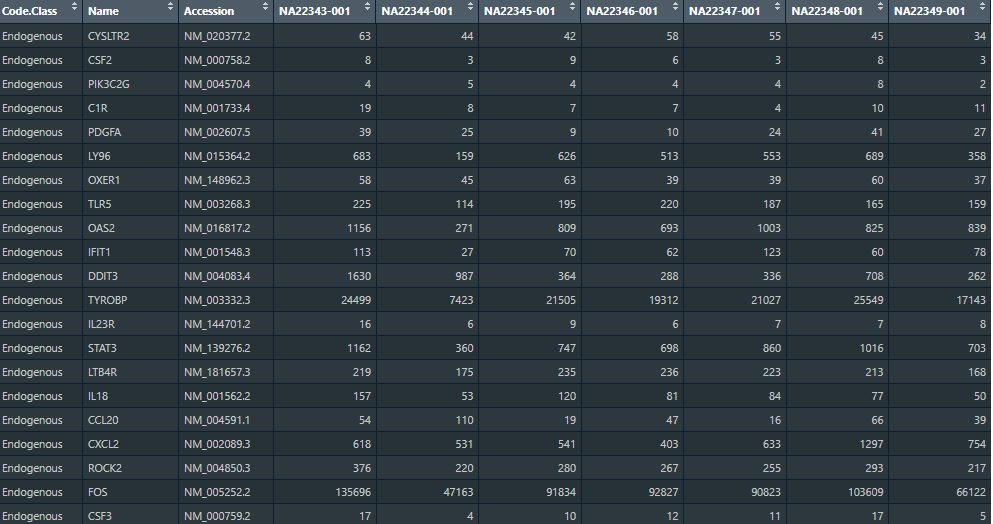
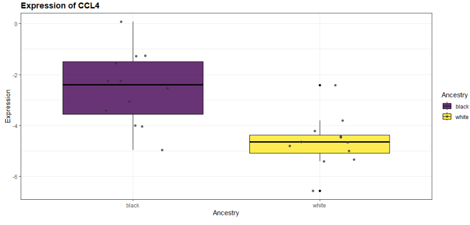
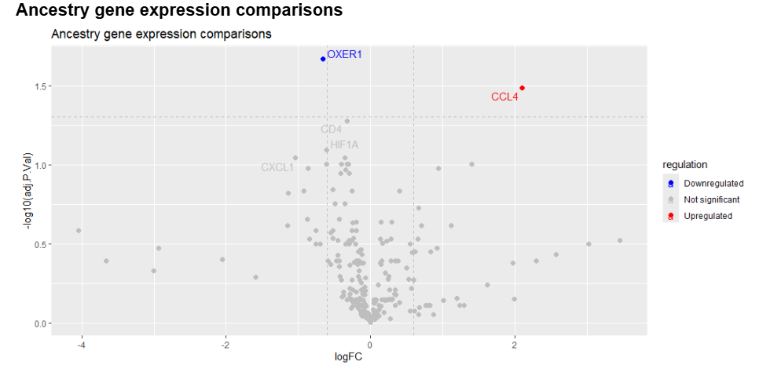

# R35 Moore Nanostring Analysis Functions

This is a simple and specific R package that is created for ease of use for pairwise and 
multiple differential pairwise gene expression. It streamlines a lot of code into functions
so your R code is neater and easier to read. This package specifically only uses limma for pairwise
and multiple differential pairwise gene expression. There are also some plotting functions
that include a boxplot, barplots, and a good volcano plot. 

This package also has many other dependencies such as: dplyr, tidyverse, clusterprofiler, org.Hs.eg.db, RColorBrewer, ggrepel, NanoTube, purr, limma, readr, pheatmap, gprofiler2. 

## Workflow
- Comparing columns with only 2 variables (Pairwise comparison):
  sumstats_and_dge(normalized_counts, metadata, "Feature column", "group1", "group2", "Character the sample starts with")
  ex: sumstats_and_dge(normalized_counts, mmetadata, 'Sex', 'Male', 'Female', 'NA')

- Comparing columns with >2 variables (Multivariate comparison or ANOVA)
  Limma_mdge_results(normalized_counts, metadata, column of interest)
  ex: Limma_mdge_results(normalized_counts, mmetadata, 'Total_Discrimination')

Both of these output a table with the fold change and the adjusted p value which should give you an idea on any significant differences.
To investigate further with a multivariate comparison do a pairwise comparison between the features with the highest log fold change.

- From there you will want to make new columns to investigate combinations of the metadata. There are more resource efficient and less cluttered ways then my new_metadata_table_function but if you wish to use it, it is there.
new_metadata_table(metadata, Column1, Column2, Combined column name that you decide)
ex: new_metadata_table(metadata, 'Ancestry', 'Sex', 'Sex_and_Ancestry')

From there you should have tables with the log fold change as well as the adjusted p values. They should have other information as well but that is not as important. 
- Create the Annotations using the GO_annotations function
- Then to add annotations to the existing pairwise comparison tables you have use the GO_definitions_to_table function
- To see the top annotations associated with each gene use the Go_anno_selection function

All of these use cluster profiler. For extra robustness I use gprofiler as well. 
- entrez_id-list(normalized_counts) gives you the entrez id list which is important for the annotations themselves
- gprofiler(E_ids) gives you the dataframe of annotations
- gene_entrez_gprofile_mapping(gprof_anno, 'intersection', normalized_counts) assigns those annotaitons to the table you choose

To plot the ontology you can use:
- gprofiler_barplot
- group_ontology_plot

For the plotting of gene expression:
Single genes:
  - Single_gene_boxplot(normalized_counts,mmetadata, 'Ancestry', 'CCL4', "Sample Name")
All genes:
  - volcano_regulation_expression(GO_ancestry_comparison, 'logFC', 'adj.P.Val', 0.6, 0.05, 5, 'Ancestry gene expression comparisons' )

## Input Data

I will describe the input data here. You will only be working with RCC files and an associated metadata.csv file  
- You will need a metadata file with the sample names along with the associated features
- You will need to read in the counts from the RCC file so they look like this:
 
  

## Results

Example output figures:

Boxplot gene expression

 

Volcano plot gene expression

 

## Acknowledgments
This package was created for the Moore Lab at University of Maryland for quicker R analysis and visualization.
 

Created by Paul Parodi

 

Last updated: 6/9/2025

